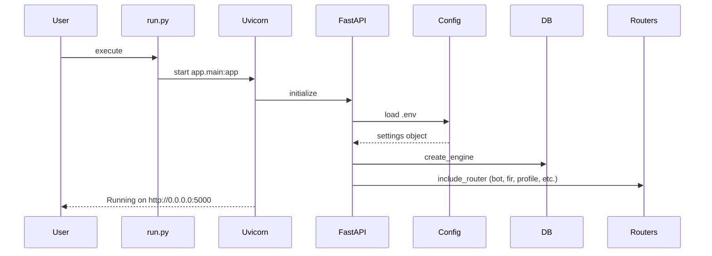
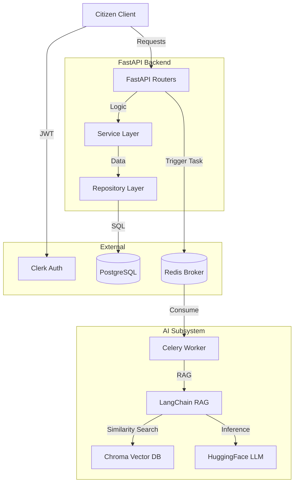

# SafeSphere Backend Architecture Analysis Report

This document provides a comprehensive analysis of the CURRENT SafeSphere backend implementation following the FastAPI migration and MVC refactor.

---

## 1. Executive Summary

*   **System Overview**: SafeSphere is a public safety platform providing FIR registration, SOS assistance, crime data search, and an AI-powered legal/safety chatbot.
*   **Core Technologies**: Python 3.x, FastAPI, SQLAlchemy (PostgreSQL), Celery (Redis), LangChain (HuggingFace, ChromaDB), Clerk (Auth).
*   **Architectural Style**: Clean MVC (Model-View-Controller) with explicit Service and Repository layers.
*   **Main Responsibilities**: User management, FIR report ingestion, geospatial safety data retrieval, and RAG-based AI assistance.
*   **Major Modules**: `app/api/routes` (Controllers), `app/services`, `app/repositories`, `app/bot` (AI Subsystem), `app/models`, `app/schemas`.
*   **Maturity Level**: Beta/Transitionary. The core structure is solid, but there are discrepancies between models and schema expectations.
*   **Scalability Assessment**: Highly scalable horizontally due to stateless FastAPI design and asynchronous task offloading via Celery.

---

## 2. Complete Application Startup Flow

1.  **Entry Point**: `python run.py` is executed.
2.  **Uvicorn Startup**: `uvicorn` loads `app.main:app`.
3.  **Environment Loading**: `app.core.config.settings` loads variables from `.env`.
4.  **FastAPI Initialization**: `app.main.py` instantiates `FastAPI()`.
5.  **Middleware Registration**: `CORSMiddleware` is added.
6.  **Exception Handler**: Global `internal_error_handler` is registered.
7.  **Router Registration**: Routers for `bot`, `fir`, `hello_auth`, `profile`, `search`, and `sos` are included.
8.  **Database Connection**: `engine` is created via SQLAlchemy in `app/models/database.py`.
9.  **Celery Initialization**: Workers start independently using `app.utils.celery_app.celery`.

### Startup Sequence Diagram


---

## 3. End-to-End Request Lifecycle

1.  **Client Request**: HTTP request hits the FastAPI endpoint.
2.  **Middleware**: `CORSMiddleware` checks origins.
3.  **Authentication**: `get_current_user` dependency (Clerk/JWT) validates the token.
4.  **Validation**: Pydantic schemas validate input data.
5.  **Router**: Calls the appropriate Service method.
6.  **Service**: Executes business logic and calls Repository.
7.  **Repository**: Uses SQLAlchemy `Session` to interact with PostgreSQL.
8.  **Response**: Data is serialized to JSON and returned to the client.

---

## 4. Actual MVC Architecture Mapping

### Controllers (Routers)
| Router | File Path | Endpoints | Dependencies |
| :--- | :--- | :--- | :--- |
| **Bot** | `app/api/routes/bot.py` | `/generate`, `/status/{id}` | `generate_answer_task` |
| **FIR** | `app/api/routes/fir.py` | `/lost-item`, `/cyber-crime`, `/rape-case`, etc. | `FIRService`, `get_db`, `get_current_user` |
| **Profile** | `app/api/routes/profile.py` | `/register`, `/check`, `/me`, `/my-firs` | `UserService`, `get_db`, `get_current_user` |
| **SOS** | `app/api/routes/sos.py` | `/nearest-police-stations`, `/crime-data` | `geopy`, Local GeoJSON files |
| **Search** | `app/api/routes/search.py` | `/search` | `get_db` (Raw SQL execution) |

### Services
*   **FIRService**: Orchestrates FIR registration across multiple types (Lost Item, Cyber Crime, etc.).
*   **UserService**: Handles user registration, profile retrieval, and updates.
*   **Bot Tasks**: `generate_answer_task` (Celery) acts as the service for the AI subsystem.

### Repositories
*   **FIRRepository**: Generic logic to save various FIR SQLAlchemy objects.
*   **UserRepository**: Retrieves/saves `User` objects by `auth_id`.
*   **BaseRepository**: Provides standard CRUD (Get, Create, Update, Delete).

### Models (SQLAlchemy)
*   **User**: `id`, `auth_id`, `name`, `status`.
*   **LostItem**, **cyberCrime**, **rapecase**, **domesticForm**, **theftEfir**, **mvTheft**, **missingPerson**: Detailed fields for specific report types.

---

## 5. Folder-by-Folder Breakdown

*   **app/api/routes/**: Entry points for all features.
*   **app/api/dependencies/**: Shared logic like DB sessions (`get_db`) and Auth (`get_current_user`).
*   **app/services/**: Core business logic; bridges controllers and data access.
*   **app/repositories/**: Data access layer; isolates SQLAlchemy queries.
*   **app/models/**: Database schema definitions.
*   **app/schemas/**: Pydantic models for request/response validation.
*   **app/core/**: Global configuration (`config.py`).
*   **app/utils/**: Shared utilities (Celery, date utils, error helpers).
*   **app/bot/**: RAG logic, vector store management, and LLM integration.

---

## 6. Dependency Graph

```
[Routers] 
    ↓ depends on
[Services / Dependencies]
    ↓ depends on
[Repositories]
    ↓ depends on
[Models / DB Session]
    ↓ interacts with
[Database]
```

---

## 7. Database Architecture

*   **Engine**: PostgreSQL (managed via SQLAlchemy `create_engine`).
*   **Session Management**: `SessionLocal` with `autocommit=False`.
*   **Transaction Management**: Handled in Repositories (explicit `db.commit()`).

### Table Inventory (Selected)
*   `users`: `auth_id` (Unique), `name`, `status`.
*   `lost_items`: `user_auth_id` (FK-like string), `item_name`, `loss_datetime`.
*   `cyber_crimes`: `crimeCategory`, `platform`, `IpAddress`.

---

## 8. Authentication & Authorization Architecture

*   **Provider**: Clerk (External).
*   **Mechanism**: JWT Verification.
*   **Flow**:
    1.  Client sends `Authorization: Bearer <token>`.
    2.  `get_current_user` retrieves Clerk's JWKS.
    3.  `PyJWT` validates signature and expiration.
    4.  `sub` (Auth ID) is extracted and passed to the router.

---

## 9. AI / RAG Subsystem Architecture

*   **Ingestion**: `retrival.py` reads Q&A text files, chunks them, and creates a `Chroma` vector store.
*   **Embeddings**: `sentence-transformers/all-MiniLM-L6-v2` via HuggingFace API.
*   **LLM**: `Mistral-Nemo-2407-12B` hosted on HuggingFace Hub.
*   **Process**:
    1.  User Query → `/api/bot/generate`.
    2.  Celery Task → `generate_answer_task`.
    3.  RAG Chain → Retrieval (Chroma) + LLM Prompting.
    4.  Result → Stored in Redis; retrieved via `/api/bot/status/{id}`.

---

## 10. Celery & Background Processing Architecture

*   **Broker/Backend**: Redis.
*   **Task Management**: Asynchronous task triggering via `.delay()`.
*   **Worker Execution**: Celery workers run the `generate_answer_task`, maintaining a persistent RAG chain connection to optimize performance.

---

## 11. External Integrations

*   **Clerk**: Identity management and JWT issuance.
*   **HuggingFace**: Hosting for LLM (Mistral) and Embeddings API.
*   **ChromaDB**: Local vector database for RAG.
*   **PostgreSQL**: Primary persistent storage.

---

## 12. Middleware Architecture

*   **CORSMiddleware**: Handles cross-origin requests from the React frontend (localhost:5173).
*   **Order**: FastAPI Default → CORS → Router-level Dependencies (Auth).

---

## 13. Error Handling Architecture

*   **Global Exception Handler**: `app.main.py` catches all unhandled exceptions and returns a 500 JSON response.
*   **Utility Helpers**: `bad_request_error`, `not_found_error` raise consistent `HTTPException`s.

---

## 14. API Inventory (Selected)

| Method | Path | Auth | Service Called |
| :--- | :--- | :--- | :--- |
| POST | `/api/fir/lost-item` | JWT | `FIRService.register_lost_item` |
| POST | `/api/bot/generate` | No | `generate_answer_task` |
| GET | `/api/profile/me` | JWT | `UserService.get_profile` |
| GET | `/api/sos/nearest-police-stations` | No | Direct Router Logic |

---

## 15. Performance Analysis

*   **Strength**: Async AI processing prevents blocking the main thread.
*   **Weakness**: SOS police station search loads a large GeoJSON file on every request.
*   **Risk**: RAG chain initialization in workers is cached but can be slow on first run.

---

## 16. Security Review

| Finding | Severity | Description |
| :--- | :--- | :--- |
| **JWT Validation** | Low | Correctly implemented using JWKS. |
| **SQL Injection** | Medium | `app/api/routes/search.py` uses `text(query_str)` with params but constructs the query string manually. |
| **Input Validation** | Low | Strong Pydantic validation across all FIR routes. |

---

## 17. Scalability Assessment

*   **Horizontal Scaling**: Excellent. FastAPI and Celery workers can be scaled independently.
*   **Bottleneck**: Redis (Broker) and PostgreSQL (DB) will eventually require clustering/RDS scaling.

---

## 18. Architectural Smells

1.  **Model-Schema Mismatch**: `app/models/models.py:User` is missing fields like `role`, `email`, and `phone` which are expected by `app/api/routes/profile.py`.
2.  **Raw SQL in Controller**: `app/api/routes/search.py` contains raw SQL logic that should ideally reside in a Repository.
3.  **Local Data Loading**: `app/api/routes/sos.py` reads GeoJSON files from disk on every request. This should be cached or moved to the database.
4.  **Inconsistent Auth**: The `bot` endpoint does not require authentication, while all other features do.

---

## 19. Current System Architecture Diagram



---

## 20. Final Architecture Scorecard

| Category | Score (1-10) |
| :--- | :--- |
| **Code Structure** | 9 |
| **Maintainability** | 7 |
| **Scalability** | 9 |
| **Security** | 8 |
| **Performance** | 7 |
| **AI Architecture** | 8 |
| **Database Design** | 6 |

### Top 3 Strengths
1.  **Clean MVC separation**: Logic is very easy to find and follow.
2.  **Async AI tasks**: Excellent use of Celery to handle heavy LLM workloads.
3.  **Modern Stack**: FastAPI and Pydantic provide great developer experience and validation.

### Top 3 Weaknesses
1.  **Model/Schema Mismatch**: Serious bug in the `User` model vs. `Profile` route.
2.  **I/O Overhead**: Loading GeoJSON files from disk in SOS.
3.  **Raw SQL in Routes**: Search logic is coupled with the controller.

### Top 3 Improvements
1.  Update `User` model to match `UserBase` schema.
2.  Move SOS data (GeoJSON) to PostgreSQL with PostGIS or cache it in memory.
3.  Refactor Search logic into a `CrimeRepository`.
